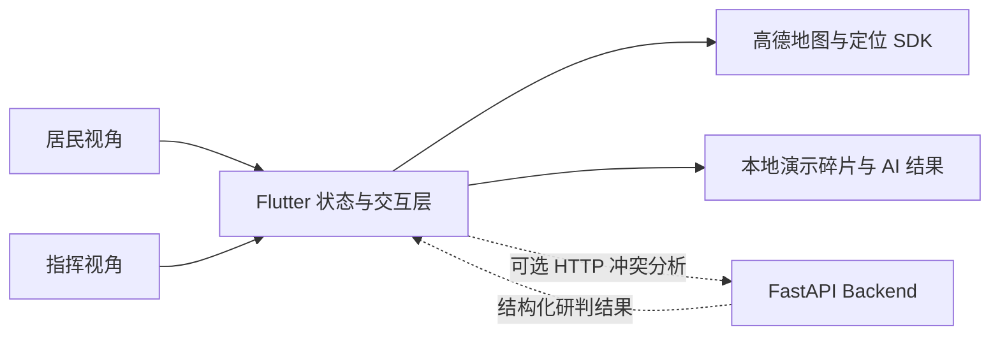

<p align="center">
  
</p>

<h1 align="center">Crisis Mosaic</h1>

<p align="center">
  将碎片化灾情转化为可定位、可比较、可复核的现场态势
</p>

<p align="center">
  <strong>AdventureX Hackathon Project</strong>
</p>

## 项目背景

灾害发生后，现场信息通常来自不同居民、不同时间和不同观察角度。真正困难的并不是“有没有人上报”，而是如何在大量碎片中识别关键事实：哪些信息已经过时，哪些说法互相冲突，哪些区域仍然缺少可靠观察。

Crisis Mosaic 是一套面向灾害现场的信息协同原型。它将每条居民上报视为一块“信息碎片”，通过地图、时间线、冲突状态和 AI 辅助研判，将碎片拼成能够被指挥人员理解和复核的态势图。

本仓库同时包含 Flutter 前端与 FastAPI 后端。本 README 聚焦 AdventureX 现场演示使用的 Flutter 前端。

## 产品理念

- 居民端与指挥端同等重要。
- 居民需要以尽可能少的步骤完成上报。
- 指挥人员需要快速看见冲突、盲区和高风险信息。
- AI 负责整理与提供依据，不替代人类做最终决定。
- 不把“较旧的信息”简单判定为虚假信息。

## 前端体验

| 居民视角 | 指挥视角 |
| --- | --- |
| 六类快捷现场上报 | 地图与信息碎片列表 |
| 高德地图定位与隐私授权 | 冲突、盲区和状态指标 |
| 紧急标记与最近上报修改 | 冲突时间线与证据可信度 |
| 回答指挥端定向问题 | AI 态势简报与冲突分析 |
| 提交结果即时反馈 | 采信建议后更新当前态势 |

### 居民端

- 支持救援、医疗、饮水、食物、避难和道路六类上报。
- 在移动端取得用户同意后初始化高德地图和前台定位。
- 可以标记紧急情况，并在提交前使用 AI 整理表达和识别风险词。
- 可以修改最近一次普通上报。
- 可以回答“大关桥是否可通行”等定向问题，用现场观察填补信息盲区。
- 居民提交的数据会立即反映到当前演示会话的指挥视角。

### 指挥端

- 展示信息碎片、位置、更新时间、来源类型和综合置信度。
- 将逻辑冲突和严重盲区作为独立状态展示，而不是埋在普通列表中。
- 通过冲突时间线比较同一地点的多条相反信息。
- 生成 AI 态势简报，汇总冲突、盲区和居民紧急上报。
- 对演示冲突执行 AI 辅助分析，展示推荐结论、证据评分和限制说明。
- 指挥人员确认结论后，界面更新冲突状态与道路事实。

## AI 冲突研判

演示中的核心冲突是“沿江路是否仍可通行”。系统会对不同时刻的文字与图片证据进行比较，并展示：

- 建议结论与综合置信度。
- 每份证据的真实性、当前可信度与支持关系。
- 信息是否可能已经过时。
- 当前结论的依据和风险提示。

AI 只提供辅助判断。最终结论仍需要指挥人员在界面中主动确认。

## 3 分钟演示流程

1. 从指挥视角查看地图、态势指标和“沿江路通行状态冲突”。
2. 点击冲突分析，等待 AI 返回证据排序和建议结论。
3. 采信最新观察，展示冲突消失以及道路事实更新。
4. 切换到居民上报，打开“大关桥”定向问题并提交现场观察。
5. 返回指挥视角，展示盲区已由居民确认并被填补。
6. 再提交一条紧急救援上报，演示居民信息即时进入当前指挥视角。

## 运行模式

### 独立演示模式

不配置 AI API 地址时，前端使用内置演示数据和本地 AI 结果，可以离线完成 AdventureX 的主要交互流程。居民新提交的数据仅保存在当前应用会话中，重启应用后会清空。

### 可选 AI API 模式

配置 `CRISIS_MOSAIC_API_BASE_URL` 后，冲突分析会调用：

```text
POST /api/v1/conflicts/{conflict_id}/ai-analysis
```

仓库根目录包含 FastAPI 后端。该兼容接口只用于开发或演示环境，需要后端启用 `ENABLE_LEGACY_DEMO_AI=true`；生产环境不应启用。

## 技术架构



主要技术：

- Flutter / Dart
- Material 3 自定义设计系统
- 高德地图与定位 Flutter SDK
- 响应式手机端布局
- 可切换的本地与远程 AI 分析服务
- Flutter Widget Test

## 项目结构

```text
.
├── android/                 Android 工程
├── assets/                  应用图标与中文字体
├── design/                  产品设计原型
├── docs/                    后端需求与部署文档
├── ios/                     iOS 工程
├── lib/                     Flutter 前端源码
│   ├── models/              信息碎片、居民上报与 AI 结果模型
│   ├── screens/             居民端与指挥端界面
│   ├── services/            AI 服务与平台传输
│   └── widgets/             地图、卡片和角色导航组件
├── test/                    Flutter 组件测试
├── src/                     FastAPI 后端源码
└── tests/                   后端测试
```

## 快速开始

### 环境要求

- Flutter SDK，Dart 3.12 或更高版本
- Android Studio / Android SDK，或 Xcode
- 移动端真实地图需要高德 Android 或 iOS Key

### 安装依赖

```powershell
flutter pub get
```

### Web 预览

Web 端可以演示全部业务界面。由于高德原生地图插件仅支持 Android 和 iOS，Web 地图区域会显示平台兼容提示。

```powershell
flutter run -d web-server `
  --web-hostname 127.0.0.1 `
  --web-port 52123 `
  --no-web-resources-cdn
```

访问 `http://127.0.0.1:52123/`。

### Android / iOS

高德 Key 不写入仓库，通过 Dart Define 注入：

```powershell
flutter run -d <device-id> `
  --dart-define=AMAP_ANDROID_KEY=<android-key>
```

iOS 使用 `AMAP_IOS_KEY`。Key 的应用包名、Bundle ID 和签名信息必须与当前平台工程一致。

### 连接可选 AI API

```powershell
flutter run -d <device-id> `
  --dart-define=AMAP_ANDROID_KEY=<android-key> `
  --dart-define=CRISIS_MOSAIC_API_BASE_URL=http://127.0.0.1:8000 `
  --dart-define=CRISIS_MOSAIC_API_TOKEN=<temporary-access-token>
```

Token 只用于本地联调，不应写入源码、APK 或 Git 历史。

## 测试

```powershell
flutter analyze
flutter test
```

组件测试覆盖以下关键流程：

- 冲突分析、采信与状态更新。
- 居民回答定向问题并填补盲区。
- 六类快捷上报入口。
- 普通上报的提交、修改和双视角同步。
- 窄屏幕和大字体下的布局适配。
- AI 态势简报与居民文本整理。

## 安全边界

- 仓库不应包含高德、AI 服务或后端签名密钥。
- AI 结果必须明确标注为辅助建议。
- 远程 Token 只能通过运行环境注入。
- 当前 Flutter 前端是黑客松交互原型，不应直接用于真实灾害调度。

---

Crisis Mosaic 试图回答一个具体问题：当现场信息彼此矛盾时，我们能否让每一条证据都保留来源、时间和不确定性，并帮助人更快形成可靠判断？
