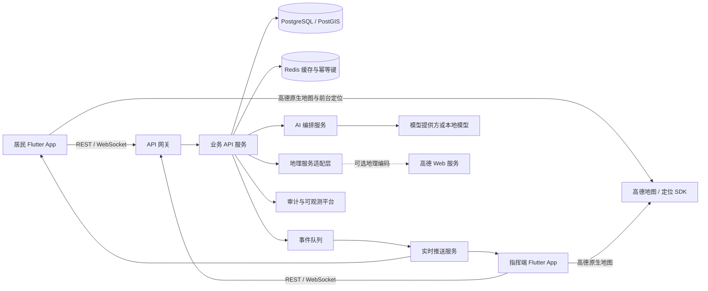
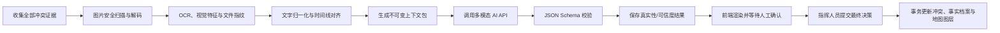

# Crisis Mosaic 后端需求文档

> 版本：v1.1  
> 日期：2026-07-24  
> 适用范围：当前 Flutter 前端原型的后端建设、联调、测试和上线  
> 前端参考：`lib/models/`、`lib/screens/`、`lib/services/ai_analysis_service.dart`、`lib/widgets/amap_location_map_mobile.dart`

## 1. 文档目标

本文档定义 Crisis Mosaic 后端第一版的业务范围、数据模型、地图与定位、API、实时同步、AI 能力、权限、安全、性能和验收标准。

后端上线后，当前前端中的本地模拟状态应全部替换为服务端真实数据，同时保持现有界面和交互不变。

## 2. 产品与业务背景

Crisis Mosaic 用于洪灾等突发事件中的现场信息协同。居民负责快速上报现场情况，指挥人员负责查看信息、识别盲区、处理冲突并形成行动判断。

系统需要解决以下问题：

1. 居民无需注册即可快速提交和修改现场信息。
2. 居民上报后，指挥端在 2 秒内看到新增或更新内容。
3. 系统可以向特定区域居民发起定向问题，以填补信息盲区。
4. 同一地点出现冲突信息时，系统保存全部证据，并允许 AI 辅助、人工确认。
5. AI 可以整理居民输入、识别风险并生成指挥态势简报，但不得替代人工决策。
6. Android/iOS 端可以通过高德地图 SDK 展示当前位置与灾情信息，同时避免把仅用于地图浏览的实时位置持续上传到后端。
7. 冲突经人工确认后，系统更新可追溯的事件事实档案，而不是覆盖或删除原始证据。

## 3. 建设范围

### 3.1 P0 必须实现

| 模块 | 必须能力 |
|---|---|
| 灾情事件 | 获取当前事件、事件状态和基本统计 |
| 地图与定位 | 提供事件地图配置、视口数据、坐标系约定、分层点位和权限过滤；支持高德地图移动端定位结果 |
| 匿名会话 | 为居民设备签发匿名身份和上报修改凭证 |
| 居民上报 | 新建、查询、修改六类现场上报，支持文字和现场图片 |
| 图片证据 | 安全上传、文件指纹、元数据提取、缩略图和 AI 视觉读取 |
| 紧急标记 | 居民手动标记或接受 AI 建议后标记紧急 |
| 指挥信息流 | 按更新时间和优先级查询全部信息 |
| 实时同步 | 新增、修改、冲突和盲区状态实时推送 |
| 定向问答 | 下发问题、居民回答、回答更新、盲区闭环 |
| 冲突管理 | 保存冲突证据、AI 分析、人工确认最终结论 |
| 事件事实档案 | 人工确认后生成或更新权威事实记录，保留历史版本、证据和 AI 分析引用 |
| AI 上报整理 | 结构化原始文本、风险提示、紧急建议 |
| AI 态势简报 | 综合上报、冲突和盲区生成行动建议与置信度 |
| 审计 | 保存关键创建、修改、AI 分析和人工决策记录 |
| 异常处理 | 幂等提交、超时重试、断线重连、AI 降级 |

### 3.2 P1 后续能力

- 指挥人员将上报标记为已查看、处理中、已解决或无效。
- 语音、视频等更大体积现场附件。
- 居民端离线队列和网络恢复自动同步。
- 多事件、多城市和多指挥组织隔离。
- 短信、App Push 或区域广播形式的定向问题通知。
- 大规模热区分析、路线规划、导航和资源调度接口。

### 3.3 本期不做

- 后端自动下达救援命令。
- AI 自动关闭冲突或自动修改居民原始事实。
- 居民实名注册、社交关系和公开评论。
- 支付、电商或物资交易。
- 将居民精确位置公开给其他居民。
- 持续或后台跟踪居民位置。
- 由业务后端代理高德底图瓦片、地图样式或原生 SDK 请求。

## 4. 用户和权限

| 角色 | 身份方式 | 权限 |
|---|---|---|
| 匿名居民 `resident` | 设备匿名会话 Token | 新建上报；查看和修改本设备上报；查看脱敏地图信息；查看并回答下发给本区域的问题 |
| 指挥人员 `operator` | 组织账号 JWT/OIDC | 查看事件内全部信息和授权精度坐标；处理冲突；查看 AI 简报；更新处理状态与事件事实档案 |
| 管理员 `admin` | 管理账号 JWT/OIDC | 管理事件、问题、成员、系统配置和审计记录 |
| 系统服务 `service` | 服务间凭证 | 写入传感器信息、执行 AI 任务、分发实时事件 |

权限要求：

- 所有资源必须按 `incident_id` 隔离。
- 匿名居民只能修改由其设备凭证创建的上报。
- 居民修改上报时必须同时校验访问 Token、资源所有权和版本号。
- 冲突最终结论只能由 `operator` 或 `admin` 提交。
- AI 结果只能作为建议，不能拥有人工决策权限。
- 居民地图接口不得返回其他居民的设备标识、精确住所或未经授权的精确坐标。
- 事件事实档案只能由人工决策、管理员操作或经过批准的系统规则更新，AI 分析接口不得直接写入权威档案。

## 5. 核心业务流程

### 5.1 居民快速上报

1. App 首次启动时申请匿名会话。
2. 居民选择上报类型：救援、医疗、饮水、食物、避难或道路。
3. 居民输入现场描述、位置和紧急状态。
4. 可选调用 AI 整理接口，前端展示建议内容和风险提示。
5. 居民确认后提交上报。
6. 后端持久化上报并生成实时事件。
7. 指挥端在 2 秒内收到新增上报。

### 5.2 修改最近上报

1. 居民读取本设备最近上报。
2. 修改正文、位置或紧急状态。
3. 前端提交当前 `revision`。
4. 后端执行乐观锁校验并创建新版本。
5. 指挥端收到 `report.updated` 事件，旧版本不再作为当前数据展示。

### 5.3 定向问题填补盲区

1. 管理员或系统为目标地点创建定向问题。
2. 符合区域条件的居民端收到 `question.published`。
3. 居民选择答案并提交。
4. 后端保存答案，并更新关联信息碎片和盲区状态。
5. 指挥端收到 `directed_answer.created` 和 `blind_spot.resolved`。

当前前端示例：询问居民“大关桥是否可通行”，回答后影响 3 条救援路线。

### 5.4 冲突分析与人工确认

1. 系统检测到同一地点、同一主题存在互斥信息。
2. 创建冲突记录并关联所有证据碎片。
3. 指挥人员请求 AI 分析。
4. AI 基于时间、新鲜度、来源和上下文给出建议、理由及置信度。
5. 指挥人员选择最终结论。
6. 后端保存决策人、选择结果、时间和证据版本。
7. 冲突状态变为已解决，并实时通知所有指挥端。

### 5.5 AI 态势简报

1. 指挥端请求生成当前事件简报。
2. 后端读取最新上报、紧急信息、未解决冲突和信息盲区。
3. AI 返回标题、摘要、建议列表、置信度和数据截止时间。
4. 新信息到达后，旧简报标记为 `stale`，前端可重新生成。

### 5.6 高德地图定位与事件地图

1. Android/iOS App 在初始化高德地图与定位 SDK 前展示隐私说明并取得用户同意。
2. App 申请系统前台定位权限，获取 `GCJ-02` 坐标、地址、精度和定位时间。
3. 仅用于“在地图上显示我在哪里”的位置保留在设备本地，不自动上传后端。
4. App 从后端获取当前事件的地图视口、灾情点位、冲突、盲区和状态图层。
5. 居民主动提交上报或回答定向问题时，才把已确认的位置及 `coordinate_system` 一并发送后端。
6. 后端验证坐标范围和精度，保留原始坐标，并生成用于 PostGIS 空间查询的标准化坐标。
7. 指挥端按角色权限读取地图点位；居民端只读取公开或模糊化后的点位。

### 5.7 AI 研判与事件事实档案更新

1. AI 冲突分析完成后只保存分析结果，不改变权威事实状态。
2. 指挥人员确认结论时，后端在同一事务内保存人工决策、更新冲突状态、更新相关信息碎片，并创建或更新事件事实档案。
3. 事实档案必须引用决策时的冲突版本、上下文包、AI 分析、采信证据和操作人。
4. 被否定或过时的资料标记为 `contradicted`、`superseded` 或 `outdated`，但不得删除原文、图片和历史版本。
5. 新证据与当前事实冲突时，原冲突可以重新打开，当前事实档案标记为待复核，并创建新版本。

## 6. 系统上下文



推荐技术并非强制，但最终实现必须满足本文的接口和非功能指标。

高德原生底图和当前设备定位由移动端 SDK 直接完成；后端负责业务点位、坐标规范、权限过滤和可选的服务端地理编码，不代理地图瓦片。

## 7. 领域对象与状态

### 7.1 上报分类 `report_category`

| 枚举值 | 前端名称 | 默认优先级建议 |
|---|---|---|
| `rescue` | 需要救援 | 高 |
| `medical` | 医疗紧急 | 高 |
| `water` | 缺少饮水 | 中 |
| `food` | 缺少食物 | 中 |
| `shelter` | 需要避难 | 中 |
| `road` | 上报道路 | 中 |

紧急状态、AI 风险识别或指挥人员调整可以覆盖默认优先级。

### 7.2 上报处理状态 `report_status`

| 状态 | 说明 |
|---|---|
| `new` | 新提交，尚未由指挥人员确认 |
| `acknowledged` | 已查看 |
| `in_progress` | 已进入处置流程 |
| `resolved` | 已处理完成 |
| `invalid` | 重复、误报或无法使用 |

P0 前端可以只展示 `new`，但后端字段和状态转换需预留。

允许的状态转换：

```text
new -> acknowledged -> in_progress -> resolved
new/acknowledged/in_progress -> invalid
invalid -> acknowledged（管理员恢复）
```

### 7.3 优先级 `priority`

- `high`：紧急上报、未解决冲突、关键盲区或人工提升。
- `medium`：普通居民上报及待确认信息。
- `low`：已确认、低时效或仅供参考的信息。

后端必须返回最终优先级和优先级来源：`manual`、`urgent_flag`、`ai`、`category_default`。

### 7.4 冲突状态 `conflict_status`

- `open`
- `analyzing`
- `analysis_ready`
- `resolved`
- `reopened`

### 7.5 定向问题状态 `question_status`

- `draft`
- `active`
- `answered`
- `expired`
- `closed`

### 7.6 AI 任务状态 `ai_job_status`

- `queued`
- `running`
- `succeeded`
- `failed`
- `timed_out`

### 7.7 定位与坐标系 `coordinate_system`

P0 API 支持：

- `gcj02`：中国大陆高德地图与高德定位 SDK 的默认坐标系；移动端地图展示默认使用该值。
- `wgs84`：GPS、PostGIS 和部分外部数据源使用的全球坐标系。

要求：

- 任何包含经纬度的请求和响应都必须显式返回 `coordinate_system`，禁止依赖接口外的隐含约定。
- 高德移动端定位结果按 `gcj02` 上报，不得误标为 `wgs84`。
- 后端保留原始经纬度与原始坐标系，同时生成 `WGS84 / SRID 4326` 标准化点用于 PostGIS 距离、边界和空间索引。
- 对移动端返回的高德地图点位默认转换为 `gcj02`，并记录转换算法版本，避免多次转换产生偏移。
- 坐标转换失败、坐标越界或经纬度只提交一项时返回校验错误，不得静默猜测坐标系。
- `bd09` 等其他坐标系只允许通过受控数据导入流程进入，并在入库时标准化；P0 公共 API 不直接接受。

## 8. 数据模型

所有主键建议使用 UUIDv7；所有时间字段使用 UTC，并以 ISO 8601 返回。

### 8.1 `incidents` 灾情事件

| 字段 | 类型 | 必填 | 说明 |
|---|---|---|---|
| `id` | UUID | 是 | 事件 ID |
| `name` | varchar(120) | 是 | 例如“杭州洪灾” |
| `type` | varchar(40) | 是 | `flood`、`earthquake` 等 |
| `status` | enum | 是 | `preparing/active/closed` |
| `center_latitude` | decimal | 否 | 事件地图中心纬度 |
| `center_longitude` | decimal | 否 | 事件地图中心经度 |
| `map_coordinate_system` | enum | 是 | 地图接口默认 `gcj02` |
| `map_default_zoom` | decimal(4,2) | 是 | 移动端首页默认缩放级别 |
| `timezone` | varchar(50) | 是 | 默认 `Asia/Shanghai` |
| `started_at` | timestamptz | 是 | 事件开始时间 |
| `closed_at` | timestamptz | 否 | 事件关闭时间 |
| `created_at` | timestamptz | 是 | 创建时间 |
| `updated_at` | timestamptz | 是 | 更新时间 |

### 8.2 `anonymous_devices` 匿名设备

| 字段 | 类型 | 必填 | 说明 |
|---|---|---|---|
| `id` | UUID | 是 | 匿名设备 ID |
| `owner_token_hash` | varchar | 是 | 修改自有上报的凭证哈希，不保存明文 |
| `platform` | enum | 是 | `android/ios/web/other` |
| `locale` | varchar(20) | 否 | 例如 `zh-CN` |
| `last_seen_at` | timestamptz | 是 | 最近活动时间 |
| `created_at` | timestamptz | 是 | 创建时间 |
| `revoked_at` | timestamptz | 否 | 凭证吊销时间 |

不采集姓名、手机号、身份证号或广告标识符。

### 8.3 `reports` 居民上报

| 字段 | 类型 | 必填 | 说明 |
|---|---|---|---|
| `id` | UUID | 是 | 上报 ID |
| `incident_id` | UUID | 是 | 所属事件 |
| `reporter_device_id` | UUID | 是 | 匿名设备 |
| `category` | enum | 是 | 六类上报 |
| `content_original` | text | 是 | 居民最终确认提交的原文，禁止被 AI 覆盖 |
| `content_display` | text | 是 | 当前展示文本，可等于原文或居民确认后的 AI 整理文本 |
| `location_text` | varchar(300) | 是 | 地点描述 |
| `latitude` | decimal(9,6) | 否 | 纬度 |
| `longitude` | decimal(9,6) | 否 | 经度 |
| `location_accuracy_m` | decimal | 否 | 定位精度 |
| `location_source` | enum | 是 | `gps/manual/question/system` |
| `coordinate_system` | enum | 否 | 有坐标时必填，P0 为 `gcj02/wgs84` |
| `location_provider` | enum | 否 | `amap/device/manual/imported` |
| `location_observed_at` | timestamptz | 否 | 获取或确认该位置的时间 |
| `location_wgs84` | geography(Point,4326) | 否 | 后端标准化空间点，仅内部查询使用 |
| `is_urgent` | boolean | 是 | 用户确认后的紧急标记 |
| `priority` | enum | 是 | `high/medium/low` |
| `priority_source` | enum | 是 | 优先级来源 |
| `status` | enum | 是 | 上报处理状态 |
| `is_directed_answer` | boolean | 是 | 是否由定向问答生成 |
| `directed_answer_id` | UUID | 否 | 关联回答 |
| `ai_refinement_id` | UUID | 否 | 关联 AI 整理记录 |
| `attachment_count` | int | 是 | 当前有效图片证据数量 |
| `revision` | int | 是 | 从 1 开始递增，用于乐观锁 |
| `created_at` | timestamptz | 是 | 首次提交时间 |
| `updated_at` | timestamptz | 是 | 最近更新时间 |
| `deleted_at` | timestamptz | 否 | 软删除时间 |

约束：

- `content_original` 和 `content_display` 去除首尾空白后长度为 1～300 字符。
- 经纬度必须同时为空或同时存在。
- 经纬度存在时 `coordinate_system` 必填；`location_source=gps` 时 `location_accuracy_m` 必填，且必须大于 0 并不超过产品配置上限。
- `location_observed_at` 不得明显晚于服务器接收时间；本机时钟异常时保留原值并记录校验标记。
- `is_urgent=true` 时，P0 默认优先级不得低于 `high`。
- 修改不得改变 `incident_id`、`reporter_device_id` 和 `created_at`。
- 每次修改必须写入历史表。

推荐索引：

- `(incident_id, updated_at desc)`
- `(incident_id, priority, updated_at desc)`
- `(reporter_device_id, updated_at desc)`
- PostGIS `location_wgs84` GIST 索引

### 8.4 `report_revisions` 上报版本

保存每次修改前后的完整业务快照。

| 字段 | 类型 | 说明 |
|---|---|---|
| `id` | UUID | 版本 ID |
| `report_id` | UUID | 上报 ID |
| `revision` | int | 版本号 |
| `snapshot` | jsonb | 该版本完整快照 |
| `changed_by_type` | enum | `resident/operator/system` |
| `changed_by_id` | UUID | 操作者 ID |
| `change_reason` | varchar | 修改原因，可为空 |
| `created_at` | timestamptz | 版本时间 |

### 8.5 `report_attachments` 上报图片证据

| 字段 | 类型 | 必填 | 说明 |
|---|---|---|---|
| `id` | UUID | 是 | 附件 ID |
| `incident_id` | UUID | 是 | 所属事件 |
| `report_id` | UUID | 否 | 关联上报；上传完成后绑定 |
| `uploader_device_id` | UUID | 是 | 上传设备 |
| `object_key` | varchar | 是 | 对象存储内部路径，不直接暴露公网地址 |
| `file_name` | varchar(255) | 是 | 原始文件名 |
| `mime_type` | varchar(80) | 是 | P0 仅允许 JPEG、PNG、WebP |
| `size_bytes` | bigint | 是 | 文件大小 |
| `width` | int | 是 | 图像宽度 |
| `height` | int | 是 | 图像高度 |
| `sha256` | char(64) | 是 | 原始文件指纹 |
| `perceptual_hash` | varchar | 否 | 重复图或近似图识别 |
| `captured_at` | timestamptz | 否 | 可信 EXIF 拍摄时间，仅作参考 |
| `latitude` | decimal | 否 | EXIF 位置，默认不信任且需与上报位置比对 |
| `longitude` | decimal | 否 | EXIF 位置 |
| `metadata_status` | enum | 是 | `pending/ready/rejected` |
| `malware_scan_status` | enum | 是 | `pending/clean/rejected` |
| `ocr_text` | text | 否 | OCR 提取文本 |
| `vision_summary` | text | 否 | 视觉模型结构化摘要 |
| `created_at` | timestamptz | 是 | 上传时间 |

要求：

- 单张图片不超过 10MB；单条 P0 上报最多 5 张。
- 上传后先进入隔离区，完成 MIME 嗅探、恶意文件扫描和解码校验后才可用于 AI。
- 对外只返回短期签名 URL 或缩略图 URL。
- EXIF 时间和地点只能作为辅助证据，不得单独决定真实性。
- 原始文件、缩略图、OCR 和视觉结果分别存储，均需关联同一 `sha256`。

### 8.6 `directed_questions` 定向问题

| 字段 | 类型 | 必填 | 说明 |
|---|---|---|---|
| `id` | UUID | 是 | 问题 ID |
| `incident_id` | UUID | 是 | 所属事件 |
| `title` | varchar(200) | 是 | 问题文本 |
| `location_text` | varchar(300) | 是 | 目标地点 |
| `target_geometry` | geography | 否 | 目标区域 |
| `route_impact_count` | int | 是 | 影响路线数 |
| `answer_type` | enum | 是 | P0 为 `single_choice` |
| `options` | jsonb | 是 | 选项 ID、文案及语义值 |
| `status` | enum | 是 | 问题状态 |
| `expires_at` | timestamptz | 否 | 过期时间 |
| `created_by` | UUID | 否 | 创建人员；系统创建可为空 |
| `created_at` | timestamptz | 是 | 创建时间 |
| `updated_at` | timestamptz | 是 | 更新时间 |

### 8.7 `directed_answers` 定向回答

| 字段 | 类型 | 必填 | 说明 |
|---|---|---|---|
| `id` | UUID | 是 | 回答 ID |
| `question_id` | UUID | 是 | 问题 ID |
| `device_id` | UUID | 是 | 回答设备 |
| `option_id` | varchar | 是 | 选择项 ID |
| `answer_text` | varchar(300) | 是 | 用于展示的标准答案文本 |
| `revision` | int | 是 | 回答版本号 |
| `created_at` | timestamptz | 是 | 首次回答时间 |
| `updated_at` | timestamptz | 是 | 修改时间 |

同一问题、同一设备仅允许一条当前回答，可通过更新修正答案。

### 8.8 `information_fragments` 信息碎片

用于指挥端统一展示居民、传感器、医院、仓库等多来源信息。

| 字段 | 类型 | 必填 | 说明 |
|---|---|---|---|
| `id` | UUID | 是 | 碎片 ID |
| `incident_id` | UUID | 是 | 所属事件 |
| `source_type` | enum | 是 | `resident/operator/sensor/organization/system` |
| `source_ref_id` | UUID | 否 | 原始来源资源 ID |
| `topic` | varchar(60) | 是 | 道路、救援、床位、物资等 |
| `label` | varchar(120) | 是 | 地图和卡片名称 |
| `description` | text | 是 | 信息描述 |
| `location_text` | varchar(300) | 是 | 地点 |
| `latitude` | decimal | 否 | 纬度 |
| `longitude` | decimal | 否 | 经度 |
| `coordinate_system` | enum | 否 | 有坐标时必填 |
| `location_wgs84` | geography(Point,4326) | 否 | 标准化空间点 |
| `shape` | enum | 是 | `circle/triangle/cross/bar/diamond/hole` |
| `status` | enum | 是 | `normal/conflict/blind/resolved` |
| `confidence` | decimal(4,3) | 是 | 0～1 |
| `observed_at` | timestamptz | 否 | 现场观察时间 |
| `received_at` | timestamptz | 是 | 系统接收时间 |
| `updated_at` | timestamptz | 是 | 更新时间 |

### 8.9 `conflict_cases` 冲突事件

| 字段 | 类型 | 必填 | 说明 |
|---|---|---|---|
| `id` | UUID | 是 | 冲突 ID |
| `incident_id` | UUID | 是 | 所属事件 |
| `title` | varchar(200) | 是 | 例如“沿江路通行状态冲突” |
| `topic` | varchar(60) | 是 | 冲突主题 |
| `location_text` | varchar(300) | 是 | 冲突地点 |
| `latitude` | decimal | 否 | 冲突中心纬度 |
| `longitude` | decimal | 否 | 冲突中心经度 |
| `coordinate_system` | enum | 否 | 有坐标时必填 |
| `status` | enum | 是 | 冲突状态 |
| `severity` | enum | 是 | `high/medium/low` |
| `detected_at` | timestamptz | 是 | 检测时间 |
| `resolved_at` | timestamptz | 否 | 解决时间 |
| `resolution` | jsonb | 否 | 最终结论快照 |
| `resolved_by` | UUID | 否 | 决策人员 |
| `revision` | int | 是 | 冲突版本 |

关联表 `conflict_evidence` 保存 `conflict_id`、`fragment_id`、证据加入时间和证据版本。

### 8.10 `ai_analyses` AI 分析记录

| 字段 | 类型 | 必填 | 说明 |
|---|---|---|---|
| `id` | UUID | 是 | 分析 ID |
| `incident_id` | UUID | 是 | 所属事件 |
| `analysis_type` | enum | 是 | `report_refinement/conflict_analysis/command_brief` |
| `status` | enum | 是 | AI 任务状态 |
| `input_snapshot` | jsonb | 是 | 输入数据快照或脱敏后的引用 |
| `context_package_id` | UUID | 否 | 多模态冲突上下文包 ID |
| `output` | jsonb | 否 | 结构化输出 |
| `confidence` | decimal(4,3) | 否 | 0～1 |
| `model_provider` | varchar | 否 | 模型提供方 |
| `model_name` | varchar | 否 | 模型版本 |
| `prompt_version` | varchar | 是 | 提示词版本 |
| `latency_ms` | int | 否 | 调用耗时 |
| `error_code` | varchar | 否 | 失败代码 |
| `created_by_type` | enum | 是 | `resident/operator/system` |
| `created_by_id` | UUID | 否 | 发起者 |
| `created_at` | timestamptz | 是 | 创建时间 |
| `completed_at` | timestamptz | 否 | 完成时间 |

### 8.11 `conflict_context_packages` 多模态冲突上下文包

每次冲突分析必须先生成不可变上下文包，用于证明“AI 当时看到了什么”。

| 字段 | 类型 | 必填 | 说明 |
|---|---|---|---|
| `id` | UUID | 是 | 上下文包 ID |
| `conflict_id` | UUID | 是 | 冲突 ID |
| `conflict_revision` | int | 是 | 分析时的冲突版本 |
| `evidence_manifest` | jsonb | 是 | 文字、图片、来源、时间、哈希和版本清单 |
| `normalized_text` | text | 是 | 归一化后的全部文字上下文 |
| `image_feature_refs` | jsonb | 是 | OCR、视觉摘要及安全图片引用 |
| `timeline` | jsonb | 是 | 按现场观察时间排列的事件序列 |
| `context_sha256` | char(64) | 是 | 上下文包整体指纹 |
| `token_estimate` | int | 是 | 模型输入规模估算 |
| `created_at` | timestamptz | 是 | 打包时间 |

上下文包一旦用于 AI 调用不得修改；资料更新后必须创建新版本。

### 8.12 `audit_logs` 审计日志

至少记录：

- 居民创建和更新上报。
- 指挥人员修改上报处理状态。
- 定向问题创建、发布、回答和关闭。
- 冲突分析请求和人工决策。
- AI 模型、提示词版本和输出引用。
- 管理员配置修改。

审计日志只允许追加，不允许业务接口修改或删除。

### 8.13 `incident_fact_records` 事件事实档案

用于保存经过人工确认、当前可供指挥决策使用的事实，同时保留其历史版本和证据链。该表不是原始上报的替代品。

| 字段 | 类型 | 必填 | 说明 |
|---|---|---|---|
| `id` | UUID | 是 | 事实档案 ID |
| `incident_id` | UUID | 是 | 所属事件 |
| `topic` | varchar(60) | 是 | 道路、桥梁、救援、物资等主题 |
| `location_text` | varchar(300) | 是 | 事实适用地点 |
| `latitude` | decimal | 否 | 地图展示纬度 |
| `longitude` | decimal | 否 | 地图展示经度 |
| `coordinate_system` | enum | 否 | 有坐标时必填 |
| `location_wgs84` | geography(Point,4326) | 否 | 标准化空间点 |
| `fact_code` | varchar(80) | 是 | 稳定机器语义，例如 `road_impassable` |
| `statement` | text | 是 | 人工确认后的事实描述 |
| `status` | enum | 是 | `current/under_review/superseded/revoked` |
| `confidence` | decimal(4,3) | 否 | 人工确认时参考的综合置信度，不等于自动决策 |
| `source_conflict_id` | UUID | 否 | 关联冲突 |
| `source_analysis_id` | UUID | 否 | 关联 AI 分析 |
| `context_package_id` | UUID | 否 | 关联不可变上下文包 |
| `accepted_evidence_ids` | jsonb | 是 | 采信证据及版本清单 |
| `decision_snapshot` | jsonb | 是 | 决策请求和关键返回字段快照 |
| `revision` | int | 是 | 从 1 递增 |
| `valid_from` | timestamptz | 是 | 事实生效时间 |
| `valid_to` | timestamptz | 否 | 被替代或撤销时间 |
| `decided_by` | UUID | 是 | 人工决策人 |
| `created_at` | timestamptz | 是 | 创建时间 |
| `updated_at` | timestamptz | 是 | 更新时间 |

要求：

- 同一事件、主题和空间范围允许存在历史记录，但同一业务事实只能有一个 `current` 版本。
- 新版本生效时，旧版本更新为 `superseded` 并设置 `valid_to`。
- 撤销事实不得删除历史证据、AI 分析、人工决策和审计记录。
- 冲突决策、事实档案、信息碎片和 Outbox 事件必须在同一数据库事务内提交。

## 9. API 通用规范

### 9.1 基础约定

- Base URL：`/api/v1`
- 协议：HTTPS
- 数据格式：`application/json; charset=utf-8`
- 时间：UTC ISO 8601，例如 `2026-07-23T09:40:00Z`
- ID：字符串形式 UUID
- 列表分页：游标分页，不使用易漂移的页码分页
- 每个响应返回 `X-Request-Id`
- 写接口支持 `Idempotency-Key`
- 更新接口使用 `revision` 或 `If-Match` 防止覆盖新数据

### 9.2 认证头

```http
Authorization: Bearer <access_token>
X-Incident-Id: <incident_id>
```

匿名会话同样使用短期 Access Token；长期修改能力由服务端保存的匿名设备身份和轮换凭证控制。

### 9.3 标准错误结构

```json
{
  "error": {
    "code": "REPORT_REVISION_CONFLICT",
    "message": "上报已在其他设备或页面更新",
    "request_id": "req_01J...",
    "details": {
      "current_revision": 3
    }
  }
}
```

通用错误码：

| HTTP | 错误码 | 说明 |
|---|---|---|
| 400 | `VALIDATION_ERROR` | 参数或业务校验失败 |
| 401 | `UNAUTHORIZED` | Token 无效或过期 |
| 403 | `FORBIDDEN` | 无资源权限 |
| 404 | `RESOURCE_NOT_FOUND` | 资源不存在 |
| 409 | `REVISION_CONFLICT` | 乐观锁冲突 |
| 409 | `IDEMPOTENCY_CONFLICT` | 相同幂等键使用了不同请求体 |
| 422 | `CONTENT_REJECTED` | 内容超限或安全校验不通过 |
| 422 | `INVALID_COORDINATE_SYSTEM` | 坐标系缺失、不支持或与数据来源不一致 |
| 422 | `INVALID_LOCATION` | 经纬度、精度或定位时间校验失败 |
| 422 | `MAP_VIEW_TOO_LARGE` | 请求视口面积或返回点位数量超过限制 |
| 429 | `RATE_LIMITED` | 请求过于频繁 |
| 503 | `AI_SERVICE_UNAVAILABLE` | AI 服务不可用，核心上报仍可继续 |

### 9.4 地图与位置通用约定

- 坐标字段统一使用 `latitude`、`longitude` 和 `coordinate_system`，不使用含义不明确的 `x/y`。
- 中国大陆高德地图展示接口默认返回 `gcj02`；PostGIS 内部空间计算使用标准化的 `wgs84`。
- `bbox` 顺序固定为 `min_longitude,min_latitude,max_longitude,max_latitude`，并通过独立参数声明坐标系。
- 对居民角色返回的地图点位应按信息敏感级别进行隐藏、聚合或模糊化；指挥角色才可读取授权精度。
- 客户端当前定位标记由设备本地渲染，不通过地图视图接口回传给服务器。
- API 不返回 `AMAP_ANDROID_KEY`、`AMAP_IOS_KEY` 或服务端高德 Web 服务 Key。
- 地图视图响应必须带 `as_of`、`coordinate_system` 和 `revision`，便于客户端去重与增量刷新。

## 10. API 需求

### 10.1 匿名会话

#### `POST /anonymous-sessions`

创建或恢复匿名设备会话。

请求：

```json
{
  "installation_id": "app-generated-random-id",
  "platform": "android",
  "locale": "zh-CN"
}
```

响应：

```json
{
  "device_id": "019...",
  "access_token": "...",
  "refresh_token": "...",
  "expires_in": 3600,
  "current_incident_id": "019..."
}
```

要求：

- `installation_id` 由 App 随机生成，不得使用硬件序列号。
- 相同安装 ID 在凭证有效时应恢复相同匿名设备。
- Refresh Token 必须支持轮换和吊销。

### 10.2 当前事件

#### `GET /incidents/current`

返回当前启用事件、连接配置和客户端功能开关。

响应至少包含：

```json
{
  "id": "019...",
  "name": "杭州洪灾",
  "type": "flood",
  "status": "active",
  "timezone": "Asia/Shanghai",
  "feature_flags": {
    "ai_report_refinement": true,
    "ai_command_brief": true,
    "directed_questions": true,
    "amap_map": true,
    "foreground_location": true
  },
  "map": {
    "provider": "amap",
    "coordinate_system": "gcj02",
    "default_center": {
      "latitude": 30.2741,
      "longitude": 120.1551
    },
    "default_zoom": 12,
    "enabled_layers": ["reports", "fragments", "conflicts", "blind_spots"]
  }
}
```

移动端高德 Key 由 CI/CD 或运行参数注入，不通过该接口动态下发。后端如需调用高德 Web 服务，只能使用单独的服务端 Key，并由密钥管理系统保存。

### 10.2.1 获取事件地图视图

#### `GET /incidents/{incident_id}/map-view`

查询参数：

| 参数 | 必填 | 说明 |
|---|---|---|
| `bbox` | 否 | `min_lng,min_lat,max_lng,max_lat`；省略时返回事件默认视口 |
| `coordinate_system` | 否 | 默认 `gcj02` |
| `zoom` | 否 | 当前地图缩放级别，用于决定是否聚合 |
| `layers` | 否 | 逗号分隔：`reports,fragments,conflicts,blind_spots,facts` |
| `updated_after` | 否 | ISO 时间，用于增量刷新 |

响应示例：

```json
{
  "incident_id": "019...",
  "coordinate_system": "gcj02",
  "revision": 42,
  "viewport": {
    "center": {"latitude": 30.2741, "longitude": 120.1551},
    "zoom": 12
  },
  "items": [
    {
      "id": "conflict:019...",
      "kind": "conflict",
      "position": {"latitude": 30.2812, "longitude": 120.1648},
      "title": "沿江路通行状态冲突",
      "status": "open",
      "severity": "high",
      "source_ref": "019...",
      "revision": 2,
      "updated_at": "2026-07-24T01:20:00Z"
    },
    {
      "id": "cluster:road:12:12015:3028",
      "kind": "cluster",
      "position": {"latitude": 30.2830, "longitude": 120.1580},
      "count": 18,
      "dominant_status": "normal"
    }
  ],
  "as_of": "2026-07-24T01:20:03Z"
}
```

要求：

- 低缩放级别优先返回聚合点，避免一次下发大量精确位置。
- 单次返回默认不超过 500 个点位；超过时返回聚合结果或要求缩小视口。
- 居民角色不得通过改变 `bbox`、`zoom` 或 `layers` 绕过位置脱敏规则。
- 地图点位必须引用真实业务资源，禁止返回无法打开详情的孤立标记。
- `facts` 图层展示当前事件事实档案；历史或已撤销事实默认不返回。

### 10.3 上传现场图片证据

P0 推荐使用预签名直传，避免大文件经过业务 API。

#### `POST /uploads/image-intents`

创建上传意图：

```json
{
  "incident_id": "019...",
  "file_name": "IMG_1429_车辆受阻.jpg",
  "mime_type": "image/jpeg",
  "size_bytes": 2841021,
  "sha256": "client-calculated-sha256"
}
```

响应：

```json
{
  "attachment_id": "019...",
  "upload_url": "https://object-storage.example/signed-upload",
  "upload_headers": {"Content-Type": "image/jpeg"},
  "expires_at": "2026-07-23T09:45:00Z"
}
```

客户端上传完成后调用：

#### `POST /uploads/{attachment_id}/complete`

后端异步执行文件指纹复核、MIME 嗅探、恶意文件扫描、图片解码、缩略图、OCR 和视觉特征提取。返回 `processing` 时客户端通过实时事件或状态接口等待完成。

#### `GET /uploads/{attachment_id}`

返回 `pending/ready/rejected`、缩略图签名 URL、OCR 状态和拒绝原因。只有 `ready` 的图片可以绑定上报并进入 AI 上下文。

### 10.4 新建居民上报

#### `POST /incidents/{incident_id}/reports`

请求头必须包含唯一 `Idempotency-Key`。

请求：

```json
{
  "category": "rescue",
  "content_original": "桥边有两位老人被困，水位仍在上涨，需要救援",
  "content_display": "【需要救援】桥边有两位老人被困，水位仍在上涨，需要救援。\n【位置】杭州市拱墅区 · 当前位置\n【建议】立即核验位置并通知附近救援力量。",
  "location": {
    "text": "杭州市拱墅区 · 当前位置",
    "latitude": 30.31,
    "longitude": 120.15,
    "accuracy_m": 35,
    "source": "gps",
    "provider": "amap",
    "coordinate_system": "gcj02",
    "observed_at": "2026-07-24T01:18:42Z"
  },
  "is_urgent": true,
  "ai_refinement_id": "019...",
  "attachment_ids": ["019-image-1...", "019-image-2..."]
}
```

响应 `201 Created`：

```json
{
  "data": {
    "id": "019...",
    "category": "rescue",
    "content_original": "桥边有两位老人被困，水位仍在上涨，需要救援",
    "content_display": "【需要救援】桥边有两位老人被困，水位仍在上涨，需要救援。\n【位置】杭州市拱墅区 · 当前位置\n【建议】立即核验位置并通知附近救援力量。",
    "location_text": "杭州市拱墅区 · 当前位置",
    "location": {
      "latitude": 30.31,
      "longitude": 120.15,
      "accuracy_m": 35,
      "coordinate_system": "gcj02",
      "observed_at": "2026-07-24T01:18:42Z"
    },
    "is_urgent": true,
    "priority": "high",
    "priority_source": "urgent_flag",
    "status": "new",
    "revision": 1,
    "created_at": "2026-07-23T09:40:00Z",
    "updated_at": "2026-07-23T09:40:00Z"
  }
}
```

后端成功提交事务后才能发送 `report.created` 事件。

### 10.5 查询上报列表

#### `GET /incidents/{incident_id}/reports`

查询参数：

| 参数 | 可选值 | 说明 |
|---|---|---|
| `priority` | `high/medium/low` | 优先级筛选 |
| `category` | 六类枚举 | 类型筛选 |
| `status` | 上报状态 | 处理状态筛选 |
| `urgent` | `true/false` | 紧急筛选 |
| `updated_after` | ISO 时间 | 增量同步 |
| `cursor` | 字符串 | 下一页游标 |
| `limit` | 1～100 | 默认 30 |

排序规则：

1. 默认按 `updated_at desc, id desc`。
2. 指挥端高优先级列表按 `priority desc, is_urgent desc, updated_at desc`。
3. 返回 `next_cursor` 和服务器数据截止时间 `as_of`。

### 10.6 查询单条上报

#### `GET /reports/{report_id}`

指挥人员可读取完整内容和来源元数据；匿名居民仅可读取本设备创建的上报。

### 10.7 修改居民上报

#### `PATCH /reports/{report_id}`

请求：

```json
{
  "revision": 1,
  "content_original": "桥边有三位老人被困，水位仍在上涨",
  "content_display": "桥边有三位老人被困，水位仍在上涨",
  "location": {
    "text": "杭州市拱墅区 · 当前位置",
    "source": "manual"
  },
  "is_urgent": true
}
```

成功后 `revision` 加 1，写入 `report_revisions` 并发送 `report.updated`。

版本冲突时返回 409 和服务器当前版本，不允许静默覆盖。

### 10.8 查询本设备最近上报

#### `GET /me/reports/recent?directed_answer=false`

供居民首页展示和修改最近一次普通上报。

### 10.9 更新上报处理状态

#### `PATCH /reports/{report_id}/status`

仅指挥角色可调用。

```json
{
  "status": "acknowledged",
  "revision": 2,
  "note": "已通知附近救援队"
}
```

### 10.10 获取定向问题

#### `GET /incidents/{incident_id}/directed-questions/active`

后端根据居民粗略位置、目标区域和问题状态返回适用问题。未授权定位时可根据用户选择的行政区匹配。

响应：

```json
{
  "data": [
    {
      "id": "019...",
      "title": "你现在能看见大关桥吗？",
      "location_text": "大关桥",
      "route_impact_count": 3,
      "answer_type": "single_choice",
      "options": [
        {"id": "open", "label": "可以正常通行"},
        {"id": "walk_only", "label": "仅行人可通行"},
        {"id": "blocked", "label": "无法通行"},
        {"id": "unknown", "label": "看不清或不确定"}
      ],
      "expires_at": "2026-07-23T12:00:00Z"
    }
  ]
}
```

### 10.11 提交或修改定向回答

#### `PUT /directed-questions/{question_id}/my-answer`

使用 `PUT` 保证同一设备对同一问题只有一个当前回答。

请求：

```json
{
  "option_id": "walk_only",
  "revision": 0
}
```

首次回答 `revision=0`；修改时提交当前版本。

返回回答和由此生成或更新的信息碎片。后端不得仅依赖单个匿名回答自动关闭高风险盲区；当前演示事件可通过配置指定最小回答数为 1。

### 10.12 查询信息碎片

#### `GET /incidents/{incident_id}/fragments`

返回地图和详情卡所需字段，包括来源、时间、状态和置信度。

可按 `status=normal/conflict/blind/resolved`、地点边界框和更新时间筛选。

有坐标的碎片必须返回 `coordinate_system`；用于高德移动端地图时应支持 `coordinate_system=gcj02` 查询参数，避免客户端自行重复转换。

### 10.13 查询冲突列表

#### `GET /incidents/{incident_id}/conflicts?status=open`

每条冲突必须返回全部当前证据，不能只返回 AI 推荐证据。

### 10.14 请求 AI 冲突分析

#### `POST /conflicts/{conflict_id}/ai-analysis`

请求包含当前冲突 `revision`。后端必须自行读取冲突关联的全部文字与图片原件，生成不可变上下文包后再调用模型；客户端传入的 OCR 或视觉摘要只能作为提示，不能替代服务端读取。

请求：

```json
{
  "conflict_revision": 2,
  "evidence_ids": [
    "text-resident-1400",
    "text-community-1424",
    "image-road-1426",
    "text-driver-1428",
    "image-turnaround-1429"
  ],
  "processing": {
    "read_original_text": true,
    "read_images": true,
    "extract_ocr": true,
    "verify_file_hash": true,
    "cross_validate_timeline": true
  }
}
```

处理顺序：

1. 校验冲突版本和证据访问权限。
2. 读取所有原始文字、图片二进制、文件指纹和来源元数据。
3. 对图片执行安全解码、OCR、视觉特征提取和重复图检测。
4. 将地点、现场观察时间、接收时间、来源、原文、图片特征和历史版本打包为完整上下文。
5. 生成 `context_sha256`，保存不可变上下文包。
6. 调用多模态 AI，并使用 JSON Schema 校验返回值。
7. 保存 API 原始状态、结构化结果、模型版本、耗时和上下文包引用。

相同冲突版本、相同证据清单和相同模型配置已有成功结果时可以直接返回缓存。

响应：

```json
{
  "analysis_id": "019...",
  "status": "succeeded",
  "context_package_id": "019-context...",
  "context_summary": {
    "image_count": 2,
    "text_count": 3,
    "digest": "图片读取 → OCR/视觉提取 → 文字归一化 → 时间线对齐 → 多来源交叉验证",
    "context_sha256": "..."
  },
  "recommended_evidence_id": "image-turnaround-1429",
  "suggested_conclusion": "沿江路东段已被积水覆盖，机动车当前不可通行",
  "reasoning_summary": "14:24 后的两条文字上报与两张现场图片相互印证；14:00 的可通行描述更可能已经过时，而非恶意虚假。",
  "confidence": 0.88,
  "evidence_assessments": [
    {
      "evidence_id": "image-turnaround-1429",
      "authenticity_score": 0.96,
      "credibility_score": 0.95,
      "verdict": "supported",
      "reason": "文件指纹完整，OCR 地点一致，图像显示全部车道被积水覆盖且车辆掉头。",
      "extracted_facts": ["14:29", "车辆掉头", "无可用机动车道"]
    },
    {
      "evidence_id": "text-resident-1400",
      "authenticity_score": 0.93,
      "credibility_score": 0.36,
      "verdict": "contradicted",
      "reason": "来源未见异常，但观察时间最早，已经被后续图文资料反驳。",
      "extracted_facts": ["14:00", "曾可通行", "信息已过时"]
    }
  ],
  "warnings": [
    "真实性高不等于资料仍然有效，过时信息不应直接判定为恶意虚假。",
    "AI 只提供辅助判断，最终结论需人工确认。"
  ],
  "engine_label": "multimodal-conflict-api",
  "model_version": "conflict-verifier-v1",
  "data_as_of": "2026-07-23T06:29:00Z"
}
```

字段解释：

- `authenticity_score`：评估文件、来源、元数据和内容是否存在篡改或伪造异常。
- `credibility_score`：综合真实性、时效性、地点一致性和其他证据支持程度后的采信分。
- `verdict`：`supported/likely/uncertain/contradicted`。
- 真实性高但可信度低通常表示“资料可能真实，但已过时或不再适用于当前状态”。

禁止返回隐藏推理过程；只返回可审计的简短依据、证据引用、提取事实和风险提示。

### 10.15 提交冲突最终决策

#### `POST /conflicts/{conflict_id}/decision`

```json
{
  "revision": 2,
  "decision": "accept_evidence",
  "accepted_evidence_id": "019-latest...",
  "conclusion": "沿江路路面已被淹，车辆不可通行",
  "note": "采信 14:28 最新上报，已安排复核"
}
```

要求：

- 必须保存操作人和操作时间。
- 必须保存决策时所使用的证据版本和 AI 分析 ID。
- 冲突已被他人处理时返回 409。
- 处理完成后发送 `conflict.resolved`、相关 `fragment.updated`，以及 `fact_record.created` 或 `fact_record.updated`。
- 必须在同一事务内创建或更新 `incident_fact_records`，不得出现冲突已解决但事件事实档案未更新的中间状态。
- 响应返回 `fact_record_id`、`fact_record_revision` 和本次 Outbox 事件 ID，供前端和审计追踪。

### 10.16 AI 整理居民上报

#### `POST /ai/report-refinements`

```json
{
  "incident_id": "019...",
  "category": "rescue",
  "content": "桥边有两位老人被困 水位还在涨 急需救援",
  "location_text": "杭州市拱墅区 · 当前位置"
}
```

响应：

```json
{
  "analysis_id": "019...",
  "refined_content": "【需要救援】桥边有两位老人被困，水位还在上涨，急需救援。\n【位置】杭州市拱墅区 · 当前位置\n【建议】立即核验位置并通知附近救援力量。",
  "risk_hint": "检测到高风险关键词，建议勾选‘情况紧急’并尽快提交。",
  "suggest_urgent": true,
  "detected_risk_tags": ["trapped_people", "elderly", "rising_water"],
  "confidence": 0.91,
  "model_version": "report-refiner-v1"
}
```

该接口只生成建议，不直接创建上报。居民必须在前端确认后再调用上报接口。

### 10.17 生成 AI 态势简报

#### `POST /incidents/{incident_id}/ai-command-briefs`

请求：

```json
{
  "scope": "current_incident",
  "include_resolved": false,
  "language": "zh-CN"
}
```

响应：

```json
{
  "analysis_id": "019...",
  "headline": "仍有关键决策风险",
  "summary": "已综合 28 条信息碎片、位置、更新时间和紧急标记，识别出 3 个需要关注的行动点。",
  "recommendations": [
    {
      "text": "沿江路存在时序冲突，建议以最新观察为准并安排复核",
      "severity": "high",
      "source_refs": ["conflict:019..."]
    },
    {
      "text": "大关桥仍是关键盲区，影响 3 条救援路线",
      "severity": "high",
      "source_refs": ["question:019..."]
    }
  ],
  "confidence": 0.56,
  "data_as_of": "2026-07-23T09:41:00Z",
  "stale": false
}
```

简报必须引用来源资源，前端可进一步打开原始证据。

### 10.18 指挥端概览

#### `GET /incidents/{incident_id}/command-overview`

用于一次请求获取首屏所需数据，减少移动网络请求数。

返回：

- 事件信息。
- 信息碎片总数。
- 高、中、低优先级数量。
- 未解决冲突数量。
- 未解决盲区数量。
- 最新信息碎片。
- 紧急居民上报。
- 当前有效 AI 简报摘要；没有时返回 `null`。
- `as_of` 和实时连接参数。

该接口不能替代列表和详情接口，只用于首屏聚合。

### 10.19 查询事件事实档案

#### `GET /incidents/{incident_id}/fact-records`

查询参数支持：

- `status=current/under_review/superseded/revoked`
- `topic`
- `bbox` 与 `coordinate_system`
- `updated_after`
- 游标分页

默认只返回 `current` 和 `under_review`。响应必须包含事实描述、当前状态、版本、生效时间、地图位置、来源冲突、AI 分析引用和采信证据摘要。

#### `GET /fact-records/{fact_record_id}`

指挥人员可读取完整决策链、历史版本、证据引用、上下文包和审计信息；居民角色只能读取被标记为公开且已脱敏的当前事实。

P0 不提供 AI 直接写入事实档案的接口。人工修订必须复用冲突决策流程，或由管理员使用独立的受审计接口完成。

## 11. 实时同步

### 11.1 连接方式

P0 使用 WebSocket；如果部署环境更适合 SSE，可以对指挥端使用 SSE，但居民端问题通知仍需 WebSocket 或 Push。

建议地址：

```text
wss://<host>/api/v1/realtime?incident_id=<id>&access_token=<short-lived-token>
```

生产环境应优先通过 WebSocket 子协议或首包鉴权传递 Token，避免长期凭证出现在日志 URL 中。

### 11.2 事件信封

```json
{
  "event_id": "evt_019...",
  "sequence": 10284,
  "type": "report.updated",
  "incident_id": "019...",
  "resource_id": "019...",
  "resource_revision": 2,
  "occurred_at": "2026-07-23T09:41:00Z",
  "data": {}
}
```

### 11.3 P0 事件类型

- `report.created`
- `report.updated`
- `report.status_changed`
- `attachment.processing`
- `attachment.ready`
- `attachment.rejected`
- `question.published`
- `question.closed`
- `directed_answer.created`
- `directed_answer.updated`
- `blind_spot.resolved`
- `conflict.opened`
- `conflict.analysis_ready`
- `conflict.analysis_failed`
- `conflict.resolved`
- `fragment.created`
- `fragment.updated`
- `fact_record.created`
- `fact_record.updated`
- `fact_record.under_review`
- `map_view.invalidated`
- `command_brief.stale`
- `incident.updated`

### 11.4 可靠性要求

- 同一事件内 `sequence` 单调递增。
- 客户端保存最后收到的 `event_id` 或 `sequence`。
- 断线重连时携带 `last_sequence`，服务端补发保留期内事件。
- 超出补发窗口时返回 `full_resync_required`，客户端重新请求概览和列表。
- 客户端按 `resource_id + resource_revision` 去重。
- WebSocket 推送采用至少一次语义，客户端不得假设恰好一次。
- 心跳间隔建议 20～30 秒，连续两次失败后重连。

## 12. AI 后端需求

### 12.1 基本原则

1. AI 不得编造人数、地点、伤情、物资数量或道路状态。
2. AI 整理结果必须保留原始事实，并与原始输入分开存储。
3. 紧急建议不能自动提交，必须由居民确认。
4. 冲突结论不能自动生效，必须由指挥人员确认。
5. 每个输出必须记录模型、提示词版本、输入数据截止时间和耗时。
6. AI 不可用时，上报、修改、问答和人工冲突处理仍须正常工作。

### 12.2 上报整理规则

- 只允许调整标点、语序和结构标签。
- 不得删除否定词，如“没有”“未发现”“不能”。
- 对人数、地点、时间、方向和状态进行一致性保护。
- 检测被困、受伤、失血、昏迷、老人、儿童、断电、坍塌、道路完全中断等风险标签。
- 风险识别输出 `suggest_urgent`，不能直接修改上报。
- 输入或模型输出超过限制时返回可理解的降级错误，前端保留原文。

### 12.3 冲突分析规则

分析至少考虑：

- 现场观察时间，而不仅是系统接收时间。
- 信息新鲜度。
- 来源类型和历史可靠性。
- 位置距离和主题是否真正相同。
- 上下游传感器或其他碎片的一致性。
- 证据数量和是否存在单一来源风险。

输出必须包含建议结论、简短依据、引用证据、置信度和警告。

### 12.4 态势简报规则

- 仅使用当前事件授权范围内的数据。
- 未解决冲突和盲区必须优先出现。
- 紧急上报必须列出，但需避免在摘要中暴露匿名居民精确身份。
- 每条行动建议至少引用一个资源 ID。
- 当源数据发生更新时将简报标记为过期。
- 同一数据版本和同一配置可缓存结果。

### 12.5 AI 服务指标

| 能力 | P95 目标 | 超时上限 |
|---|---:|---:|
| 上报整理 | 2 秒 | 5 秒 |
| 冲突分析 | 4 秒 | 10 秒 |
| 态势简报 | 5 秒 | 15 秒 |

超时后返回明确状态，不阻塞核心业务请求。

### 12.6 模型供应商抽象

业务层不得直接依赖特定模型 SDK。AI 编排服务需要提供统一接口，支持：

- 云端模型与本地模型切换。
- 模型和提示词灰度发布。
- 超时、重试、熔断和降级。
- 结构化 JSON Schema 输出校验。
- 敏感信息脱敏。
- 成本、Token 和延迟统计。

### 12.7 多模态冲突研判流水线

生产实现必须将多模态分析拆分为可观察、可重试的步骤：



流水线要求：

- 每一步记录开始时间、结束时间、状态和错误码。
- 图片处理失败不能将该图片静默排除；结果中必须标记为未读取。
- 上下文按现场观察时间排序，同时保留系统接收时间。
- 对同一文件哈希、感知哈希和相似内容进行聚类，防止多人转发同一张图被误认为多个独立来源。
- 来源数量和证据数量必须分别计算，不能把同源转发当作交叉验证。
- 模型输出必须逐条对应证据 ID，不允许产生不存在的证据引用。
- API 调用失败时保留上下文包，允许人工点击重试而不重复处理图片。
- 新资料到达后旧分析标记为 `stale`，不得继续显示为“最新结论”。
- 不同坐标系的资料必须先标准化后再进行距离、同地点和上下游关系判断，禁止直接比较未经转换的经纬度。
- AI 可以引用当前事件事实档案作为上下文，但必须区分“已人工确认事实”和“待确认原始证据”。
- 前端至少渲染：上下文数量、API 状态、建议结论、综合可信度、每条证据真实性、每条证据可信度、依据、风险提示和人工确认按钮。

真实性评估信号包括但不限于：

- 原始文件 SHA-256、感知哈希和重复传播关系。
- 文件是否可正常解码、是否存在编辑或拼接异常。
- EXIF 与服务器接收时间、上报地点是否冲突。
- OCR 地名、道路标识和文字上报地点是否一致。
- 来源设备历史行为和异常提交频率；不得据此歧视特定人群。

可信度评估信号包括但不限于：

- 现场观察时间与信息新鲜度。
- 地点和主题是否确实属于同一冲突。
- 图片视觉内容与文字陈述是否一致。
- 是否被不同来源、不同模态的证据独立支持。
- 是否与传感器、水位趋势或官方资料一致。
- 是否存在更新资料足以解释冲突，而非简单判断一方“造假”。

## 13. 非功能需求

### 13.1 性能

| 场景 | 指标 |
|---|---|
| 创建或修改上报 | 后端 P95 小于 800ms，不含 AI 调用 |
| 指挥端列表查询 | P95 小于 1 秒 |
| 首屏概览 | P95 小于 1.2 秒 |
| 地图视口查询 | P95 小于 800ms，默认不超过 500 个点位 |
| 事件事实档案查询 | P95 小于 800ms |
| 实时事件可见延迟 | 事务提交后 P95 小于 2 秒 |
| 普通详情查询 | P95 小于 500ms |

初始容量基线：

- 单事件 20,000 个实时连接。
- 单事件峰值 200 次写请求/秒。
- 单事件每天 100,000 条上报及更新。
- 实时服务每秒 1,000 条事件扇出能力。

上线前需根据实际灾害演练结果重新确认容量。

### 13.2 可用性与灾备

- 核心 API 月可用性目标不低于 99.9%。
- AI 服务故障不得降低核心上报 API 的可用性。
- 高德地图或地理编码服务不可用时，文字上报、坐标存储和人工冲突处理仍须可用。
- 数据库使用多可用区或等效高可用方案。
- RPO 不高于 5 分钟，RTO 不高于 30 分钟。
- 每日全量备份并保留至少 30 天；关键表启用持续归档。

### 13.3 弱网与幂等

- 所有创建接口必须支持 `Idempotency-Key`，建议保留 24 小时。
- 相同幂等键和相同请求体返回第一次成功结果。
- 相同幂等键但不同请求体返回 409。
- 移动端超时后可以安全重试，不产生重复上报。
- 返回服务器时间，帮助客户端处理本机时间错误。
- 列表和资源响应支持 ETag 或版本校验。
- 地图视图支持按 `updated_after` 增量刷新；弱网下优先返回聚合点和关键高优先级图层。

### 13.4 数据一致性

- 数据库写入和事件写入采用事务消息或 Outbox Pattern。
- 不允许数据库提交成功但实时事件永久丢失。
- 资源更新使用乐观锁。
- AI 简报必须记录输入数据版本和 `data_as_of`。
- 人工冲突决策、事实档案更新、地图碎片更新、审计日志和 Outbox 事件必须原子提交。

## 14. 安全与隐私

### 14.1 安全要求

- 全链路 TLS 1.2 以上。
- Token、密钥和数据库凭证通过密钥管理服务保存。
- 高德 Android/iOS Key 通过移动端 CI/CD 安全配置注入；服务端高德 Web 服务 Key 与客户端 Key 分离，禁止通过业务 API 返回。
- Refresh Token 和匿名所有权凭证只保存哈希。
- 管理后台和指挥账号启用 MFA。
- 所有输入进行长度、枚举、坐标和危险字符校验。
- 坐标转换服务必须限制输入范围、调用频率和视口面积，防止批量枚举精确位置。
- 防止 SQL 注入、越权、重放、批量枚举和资源 ID 猜测。
- AI 输入视为不可信内容，防止提示词注入改变系统规则。
- 图片必须校验真实 MIME、文件头、尺寸、解码结果和恶意内容；禁止根据文件扩展名直接信任类型。
- 图片下载和模型读取通过内部对象引用或短期签名 URL，防止 SSRF 和永久公网暴露。
- 默认剥离非必要 EXIF 后再向第三方模型发送，并保留内部原始指纹用于审计。
- 接口按设备、账号、IP 和事件维度限流。

建议限流基线：

- 匿名会话：每 IP 每分钟 10 次。
- 创建上报：每设备每分钟 6 次，允许灾时配置提升。
- 更新上报：每设备每分钟 12 次。
- AI 整理：每设备每分钟 6 次。
- AI 简报：每操作员每分钟 6 次。

### 14.2 隐私要求

- 居民无需提供姓名、手机号和身份证号。
- 用户仅在本机查看当前位置时，后端不得接收或记录该位置。
- 只有居民主动提交上报、定向回答或明确触发需要位置的业务操作时，客户端才可上传位置。
- P0 只申请前台定位，不申请后台持续定位；不得根据地图打开行为建立居民移动轨迹。
- 精确坐标仅对授权指挥人员可见。
- 居民端地图中的他人点位必须按风险等级隐藏、聚合或模糊化，禁止展示精确住所。
- 日志默认不记录完整居民正文、Token 和精确坐标。
- 高德 SDK 隐私声明和系统定位授权由客户端单独取得；拒绝授权不影响文字上报和手工输入地点。
- AI 调用前按模型部署策略执行数据最小化和脱敏。
- 事件关闭后按数据保留策略删除或匿名化居民数据。
- P0 建议业务数据保留 180 天，审计日志保留 1 年；最终周期由法务确认。

## 15. 可观测性与运维

### 15.1 必须监控的指标

- API 请求量、P50/P95/P99 延迟和错误率。
- 上报创建、更新成功率和幂等命中率。
- WebSocket 在线连接数、重连次数、事件积压和推送延迟。
- 数据库连接池、慢查询、锁等待和复制延迟。
- AI 成功率、超时率、模型延迟、成本和结构化输出失败率。
- 冲突从发现到解决的平均耗时。
- 盲区从问题发布到首个有效回答的耗时。
- 地图视口查询量、聚合率、返回点位数量、空间查询耗时和坐标转换失败率。
- 事件事实档案创建、更新、待复核和版本冲突数量。

### 15.2 日志和链路追踪

- 全链路使用 `request_id` 和 `trace_id`。
- 实时事件携带源请求追踪 ID。
- 业务日志结构化输出，不写 Token 和敏感正文。
- AI 分析记录可追溯到模型、提示词版本和输入资源版本。

### 15.3 告警基线

- 5 分钟核心 API 错误率超过 2%。
- P95 上报接口延迟超过 1.5 秒。
- 实时事件 P95 延迟超过 2 秒。
- Outbox 或消息队列积压超过 30 秒。
- AI 失败率连续 10 分钟超过 20%。
- 数据库主从延迟超过 10 秒。
- 地图视口 P95 连续 10 分钟超过 1.5 秒，或坐标转换失败率超过 1%。
- 冲突已解决但事实档案事务失败的次数必须为 0；发现即最高级别告警。

## 16. 配置与环境

需要提供：

- `dev`、`staging`、`production` 三套隔离环境。
- 独立数据库、缓存、队列和对象存储配置。
- 事件级功能开关。
- AI 模型、提示词版本和超时配置。
- 地图默认中心、缩放级别、允许图层、视口面积上限和单次点位上限。
- 坐标存储策略、默认返回坐标系和坐标转换算法版本。
- `AMAP_ANDROID_KEY`、`AMAP_IOS_KEY` 由移动端构建环境注入；可选 `AMAP_WEB_SERVICE_KEY` 只存在于后端密钥管理中。
- 定向问题最小有效回答数。
- 数据保留周期和速率限制配置。
- API OpenAPI 3.1 文档和 WebSocket 事件 Schema。

禁止将密钥、模型 Token 或数据库密码写入代码仓库。

Web 前端部署要求：

- 在无法稳定访问 Google CDN 的环境中，必须使用 `flutter build web --no-web-resources-cdn` 构建。
- 部署服务必须自托管 `canvaskit.js`、`canvaskit.wasm` 和字体资源，不依赖 `www.gstatic.com` 或 `fonts.gstatic.com`。
- `.wasm` 返回 `Content-Type: application/wasm`；带哈希静态资源可长期缓存，`index.html` 和 `flutter_bootstrap.js` 应支持快速更新。
- CSP 的 `connect-src` 仅开放业务 API、WebSocket 和明确批准的服务地址。

## 17. 前后端联调要求

### 17.1 Flutter 需要替换的本地状态

| 当前前端本地实现 | 后端来源 |
|---|---|
| `_reports` 内存列表 | 上报 REST API + 实时事件 |
| `_nextReportId` | 服务端 UUID |
| `_conflictResolved`、`_roadFlooded` | 冲突详情与决策接口 |
| `_directedReport` | 定向问题回答与碎片接口 |
| `demoFragments` | 信息碎片接口 |
| `LocalAiAnalysisService` | AI REST API 适配器 |
| 固定统计数 27 | 指挥端概览统计 |
| 首页高德地图业务点位 | 事件地图视图接口 + 信息碎片/事实档案实时事件 |
| 移动端当前位置标记 | 高德定位 SDK 本地状态；只有提交业务数据时才进入上报 API |
| 冲突处理后的本地布尔状态 | 冲突决策接口 + `incident_fact_records` 当前版本 |

### 17.2 客户端缓存建议

- 保存匿名会话和 Token，使用系统安全存储。
- 保存最近一次普通上报 ID 和版本号。
- 保存当前事件 ID、最近同步游标和最后实时序列号。
- 可以短期缓存地图视口版本和业务点位，但不得长期缓存其他居民精确坐标。
- 当前实时位置默认只保存在内存；用户未提交上报时不写入服务端或持久化客户端日志。
- 不长期缓存完整指挥端敏感数据。
- 更新失败时保留输入内容，明确展示失败状态。

## 18. 测试要求

### 18.1 单元和集成测试

后端至少覆盖：

- 六类上报创建。
- 空内容、超长内容和非法坐标校验。
- 幂等创建不会产生重复记录。
- 匿名设备不能修改其他设备上报。
- 上报修改生成版本历史。
- 乐观锁冲突返回 409。
- 紧急上报进入高优先级。
- 定向问题回答创建和更新。
- 冲突 AI 分析不能直接解决冲突。
- 人工决策保存审计和证据版本。
- AI 故障时核心上报正常。
- Outbox 重试后实时事件最终送达。
- `gcj02` 上报能够正确生成 WGS84 空间点，往返高德地图展示不发生重复转换或明显漂移。
- 缺失或伪造 `coordinate_system`、非法经纬度和异常精度被拒绝。
- 地图视图按角色过滤精确位置，居民无法通过扩大 `bbox` 绕过脱敏。
- 仅打开地图和重新定位不会向后端产生位置写入。
- 人工冲突决策能够原子创建或更新事件事实档案，并保留旧事实版本。

### 18.2 契约测试

- 根据 OpenAPI 自动验证请求和响应。
- Flutter CI 使用后端 Mock 或测试环境运行契约测试。
- WebSocket 事件必须通过 JSON Schema 校验。
- 枚举和错误码不得在未版本化的情况下破坏兼容性。

### 18.3 性能测试

- 模拟居民突发集中上报。
- 模拟 20,000 个 WebSocket 长连接。
- 模拟指挥端持续接收、断线和补发。
- 验证数据库故障转移和消息积压恢复。
- AI 服务超时和熔断演练。
- 大视口、高密度点位和不同缩放级别的地图聚合压测。
- 事件事实档案与冲突决策并发更新、回滚和 Outbox 一致性测试。
- Web 产物在阻断 `gstatic.com` 的环境中完成启动烟雾测试。

## 19. P0 验收标准

1. 居民可以匿名创建六类上报。
2. 内容为空时后端拒绝请求，已输入内容由前端保留。
3. 同一个创建请求重试不会产生重复上报。
4. 居民可以修改本设备最近上报，`revision` 正确递增。
5. 其他匿名设备无法读取或修改该居民的私有上报详情。
6. 新增或修改后，指挥端 P95 在 2 秒内收到更新。
7. 指挥端能按高、中、低优先级读取信息。
8. 紧急上报进入高优先级并保留紧急来源。
9. 定向问题回答后，大关桥盲区状态和相关信息碎片得到更新。
10. 冲突分析返回建议、依据、证据引用和置信度。
11. 只有人工决策接口能将冲突标记为已解决。
12. AI 上报整理不修改原始事实，居民可以拒绝 AI 建议。
13. AI 态势简报能反映最新紧急上报、冲突和盲区，并标明数据截止时间。
14. AI 服务完全不可用时，居民上报、修改和指挥查询仍正常。
15. 所有关键操作可通过审计日志追踪。
16. 居民上报可以绑定图片，后端完成安全扫描、文件指纹、OCR 和视觉摘要。
17. 冲突分析能够读取至少两张图片和三条文字，生成不可变上下文包。
18. API 返回每条资料的真实性分、可信度分、判断、依据和提取事实。
19. 前端能够渲染上下文处理过程、API 返回状态、证据排序、综合结论和风险提示。
20. 新资料加入冲突后，旧分析被标记为过期并可基于新上下文重新分析。
21. 重复图片或同源转发不能被错误计算为多个独立来源。
22. 图片或 AI 处理失败时仍允许人工查看原始文字、图片状态并解决冲突。
23. OpenAPI、实时事件 Schema、部署说明和环境变量清单齐全。
24. Android/iOS 在用户同意隐私说明并授予前台定位权限后，可以显示当前位置、地址和精度。
25. 仅用于浏览地图的当前位置不会上传后端；拒绝定位权限后仍可手工填写地点和提交文字上报。
26. 事件地图接口返回明确坐标系、视口版本、业务资源引用和权限过滤后的点位。
27. 高德 `GCJ-02` 定位数据与 PostGIS `WGS84` 空间数据能够正确转换，且不会因重复转换产生明显偏移。
28. 人工确认冲突后，事件事实档案、信息碎片、冲突状态、审计和实时事件原子更新。
29. 新证据推翻当前事实时，旧档案保留并标记为待复核或已被替代，所有原始证据仍可审计。
30. Web 产物不依赖 Google CanvasKit/字体 CDN，在阻断 `gstatic.com` 的网络中仍可正常显示界面。

## 20. 推荐交付阶段

### 阶段一：核心数据链路

- 匿名会话。
- 当前事件。
- 地图配置、坐标标准化和事件地图视图。
- 上报创建、查询、修改和版本历史。
- 指挥端概览和列表。
- WebSocket 实时同步。

### 阶段二：态势闭环

- 信息碎片。
- 定向问题和回答。
- 盲区更新。
- 冲突记录、证据和人工决策。
- 事件事实档案及地图图层实时更新。

### 阶段三：AI 与生产化

- AI 整理、冲突分析和态势简报。
- 模型降级、审计和成本监控。
- 压力测试、灾备、安全评审和灰度发布。

## 21. 待确认事项

以下内容不阻塞 P0 开发，但需要产品、后端和安全团队在上线前确认：

1. 一个匿名设备是否允许同时维护多条普通上报，还是只突出最近一条。
2. 定向问题关闭盲区所需的最小有效回答数和来源可信度规则。
3. 精确位置的数据保留时间及指挥人员的可见范围。
4. 指挥账号体系接入现有 OIDC、企业微信或独立账号。
5. AI 模型使用云端服务还是私有部署。
6. 正式容量基线、目标城市数量和同时活跃事件数量。
7. 上报内容的正式审核、投诉和删除流程。
8. 事件关闭后精确坐标、位置草稿和事实档案各自的正式保留周期。
9. 高德 Web 服务是否用于服务端地理编码，以及调用限额、容灾和费用预算。
10. 居民地图中不同信息等级采用隐藏、聚合还是模糊化坐标的产品规则。
11. 哪些主题的事实档案允许自动进入 `under_review`，以及重新开放冲突的阈值。
